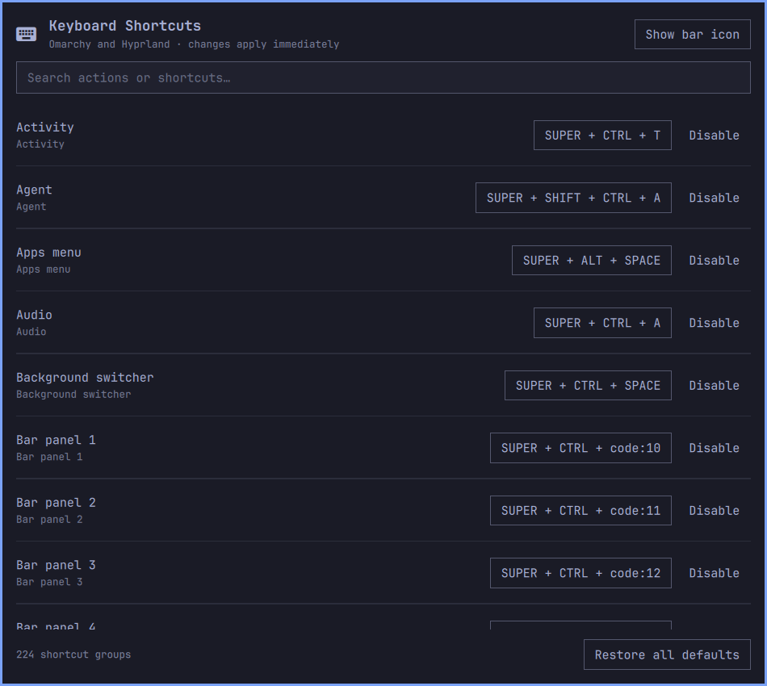

# Omarchy Keyboard Shortcuts

A native Omarchy settings panel for viewing and changing Hyprland keyboard
shortcuts. It applies changes immediately while keeping handwritten Lua and
Omarchy's packaged defaults untouched.



## Features

- Search all effective Omarchy and user shortcut groups by name, typed shortcut,
  or by pressing the shortcut chord.
- Display physical `code:N` bindings as familiar keys using the active XKB
  keymap, while preserving their layout-independent representation internally.
- Capture a new shortcut directly from the keyboard.
- Suspend Hyprland actions while capturing, then restore them immediately;
  `Super+Esc` is an emergency reset if capture is ever interrupted.
- Detect conflicts and explicitly replace an existing assignment.
- Disable one shortcut, reset one shortcut, or restore all defaults.
- Validate every generated Lua change with `hyprctl reload` and
  `hyprctl configerrors`, rolling back automatically on failure.
- Open from `Setup > Keyboard > Keyboard Shortcuts` with an optional bar icon.
- Preserve advanced callback-based Lua bindings as visible, read-only entries.

## Install

### Requirements

- Omarchy Quattro with its Hyprland Lua configuration and Omarchy shell.
- Python 3, `hyprctl`, and `omarchy-shell`, all provided by Omarchy.
- `xkbcli` is optional and improves labels for physical `code:N` bindings.

Install the public repository through Omarchy, then explicitly run its
integration step:

```bash
omarchy plugin add https://github.com/sahzudin/omarchy-keymap.git --yes
~/.config/omarchy/plugins/io.github.sahzudin.keymap/install.sh
```

The integration step adds marked, reversible entries to the user's Hyprland,
Omarchy menu, and shell configuration. It runs entirely with user permissions
and leaves packaged files under `/usr/share/omarchy` untouched.

The panel is installed without a bar icon by default. To start with one:

```bash
~/.config/omarchy/plugins/io.github.sahzudin.keymap/install.sh --with-bar
```

When the icon is hidden, `omarchy plugin list` reports this mixed
`panel,bar-widget` plugin as `disabled`; for mixed plugins that column describes
bar placement. The panel remains enabled through `shell.json` and continues to
open from the Omarchy menu.

For development, place or symlink this directory at
`~/.config/omarchy/plugins/io.github.sahzudin.keymap`, rescan plugins, and run
`./install.sh`.

## How persistence works

The installer adds one marked `require("hypr.keymap")` block to
`~/.config/hypr/bindings.lua`. The settings panel owns only these files:

- `~/.config/hypr/keymap.lua` — generated `hl.unbind` and `o.bind` calls.
- `~/.config/omarchy-keymap/overrides.json` — the editable shortcut model.
- `~/.local/state/omarchy-keymap/backups/` — timestamped backups.

The generated file first unbinds every affected source and destination chord,
then recreates the selected actions. Removing an override therefore exposes
the current Omarchy default again instead of freezing an old copy.

## Command-line backend

```bash
python3 scripts/keymap.py list
python3 scripts/keymap.py set <group-id> "SUPER + SHIFT + R"
python3 scripts/keymap.py disable <group-id>
python3 scripts/keymap.py reset <group-id>
python3 scripts/keymap.py reset-all
python3 scripts/keymap.py set-bar true
```

## Remove

Run the cleanup before deleting the plugin directory:

```bash
~/.config/omarchy/plugins/io.github.sahzudin.keymap/uninstall.sh
omarchy plugin remove io.github.sahzudin.keymap
```

Use `uninstall.sh --purge` to also remove the generated keymap and saved
overrides. Without `--purge`, those inactive files remain available for a
future reinstall.

## Development checks

```bash
python3 -m unittest discover -s tests -v
python3 -m py_compile scripts/keymap.py
```
